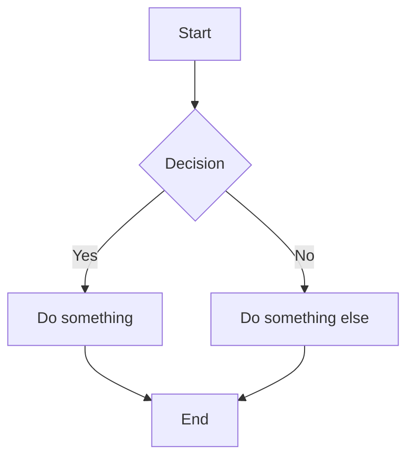

# Quick Start

## For Users

Download from [Releases](https://github.com/fernandopicardi/excalidraw-desktop/releases):

- **Setup**: `Excalidraw-Desktop-1.0.0-Setup.exe` — installs with shortcuts
- **Portable**: `Excalidraw-Desktop-1.0.0-Portable.exe` — runs directly

## For Developers

```bash
git clone https://github.com/fernandopicardi/excalidraw-desktop.git
cd excalidraw-desktop
yarn install
yarn dev          # Build + launch Electron
yarn dev:hot      # Vite dev server + Electron (hot reload)
yarn dist         # Create installer and portable .exe
```

## Using Mermaid Diagrams

1. Click the **More Tools** button (`...`) in the toolbar
2. Select **Mermaid to Excalidraw**
3. Type or paste Mermaid code — preview updates automatically
4. Click **Insert** to add to canvas

Or press **Ctrl+M** to open the Mermaid dialog directly.

### Example



## File Operations

| Action | Shortcut |
|--------|----------|
| New | Ctrl+N |
| Open | Ctrl+O |
| Save | Ctrl+S |
| Save As | Ctrl+Shift+S |
| Mermaid | Ctrl+M |
| Quit | Ctrl+Q |
