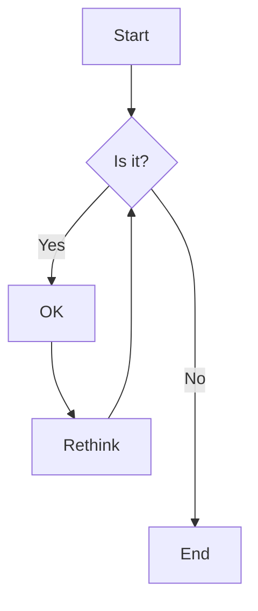

# Excalidraw Desktop

Um aplicativo desktop Windows que integra o Excalidraw com funcionalidades de conversão Mermaid-to-Excalidraw, empacotado em Electron.

## 🚀 Funcionalidades

- ✅ **Excalidraw Completo**: Todas as funcionalidades do Excalidraw web
- ✅ **Integração Mermaid**: Converter diagramas Mermaid para elementos Excalidraw
- ✅ **Interface Desktop**: Menu nativo, atalhos de teclado, drag & drop
- ✅ **Persistência Local**: Salvar e abrir arquivos .excalidraw
- ✅ **Exportação**: PNG, SVG e outros formatos
- ✅ **Versão Portátil**: Executável sem instalação
- ✅ **Instalador Windows**: Instalação tradicional com .exe

## 📦 Tipos de Diagrama Mermaid Suportados

- **Flowchart**: Diagramas de fluxo
- **Sequence Diagram**: Diagramas de sequência
- **Class Diagram**: Diagramas de classe
- **State Diagram**: Diagramas de estado
- **Gantt Chart**: Gráficos de Gantt
- **E mais...**

## 🛠️ Desenvolvimento

### Pré-requisitos

- Node.js 18.x ou superior
- Yarn 1.22.22
- Git

### Instalação

```bash
# Clonar o repositório
git clone https://github.com/fernandopicardi/excalidraw-desktop.git
cd excalidraw-desktop

# Instalar dependências
yarn install

# Desenvolvimento
yarn dev

# Build para produção
yarn build

# Empacotar para Windows
yarn dist
```

### Scripts Disponíveis

- `yarn dev` - Modo desenvolvimento (Vite + Electron)
- `yarn build` - Build do renderer (React)
- `yarn start` - Executar Electron
- `yarn dist` - Criar instalador Windows
- `yarn pack:portable` - Criar versão portátil

## 🏗️ Arquitetura

```
excalidraw-desktop/
├── electron/                 # Processo principal Electron
│   ├── main.js              # Janela principal e menu
│   └── preload.js           # API segura para renderer
├── packages/
│   └── desktop-renderer/    # Aplicação React + Excalidraw
│       ├── src/
│       │   ├── components/  # Componentes React
│       │   ├── hooks/       # Hooks customizados
│       │   └── styles/      # Estilos CSS
│       └── package.json
├── build/                   # Build de produção
└── dist/                    # Aplicativo empacotado
```

## 🎯 Como Usar

### 1. Criar Novo Diagrama
- Use `Ctrl+N` ou menu File > New
- Desenhe livremente com as ferramentas do Excalidraw

### 2. Importar Diagrama Mermaid
- Use `Ctrl+M` ou menu File > Import Mermaid
- Cole o código Mermaid no modal
- Clique em "Convert" para preview
- Clique em "Insert into Canvas" para adicionar

### 3. Salvar e Abrir
- `Ctrl+S` para salvar
- `Ctrl+O` para abrir arquivos .excalidraw

## 📋 Exemplo de Código Mermaid



## 🔧 Configurações

### Tema
- Claro/Escuro automático baseado no sistema
- Toggle manual com `Ctrl+Shift+T`

### Atalhos de Teclado
- `Ctrl+N` - Novo
- `Ctrl+O` - Abrir
- `Ctrl+S` - Salvar
- `Ctrl+M` - Importar Mermaid
- `Ctrl+Z` - Desfazer
- `Ctrl+Y` - Refazer

## 🚀 Distribuição

### Versão Portátil
- Arquivo ZIP com executável
- Não requer instalação
- Tamanho: ~150-200MB

### Instalador Windows
- Arquivo .exe com instalador
- Instalação em Program Files
- Atalhos no menu Iniciar
- Tamanho: ~200-250MB

## 🤝 Contribuição

1. Fork o projeto
2. Crie uma branch para sua feature (`git checkout -b feature/AmazingFeature`)
3. Commit suas mudanças (`git commit -m 'Add some AmazingFeature'`)
4. Push para a branch (`git push origin feature/AmazingFeature`)
5. Abra um Pull Request

## 📄 Licença

Este projeto está sob a licença MIT. Veja o arquivo [LICENSE](LICENSE) para detalhes.

## 🙏 Agradecimentos

- [Excalidraw](https://excalidraw.com) - Editor de desenho
- [Mermaid](https://mermaid-js.github.io) - Diagramas
- [Electron](https://electronjs.org) - Framework desktop
- [React](https://reactjs.org) - Interface de usuário

## 📞 Suporte

- Issues: [GitHub Issues](https://github.com/fernandopicardi/excalidraw-desktop/issues)
- Email: fernandopicardi@gmail.com

---

**Desenvolvido com ❤️ por fernandopicardi**
