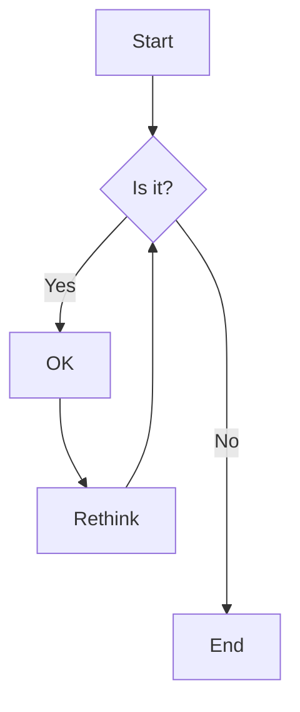
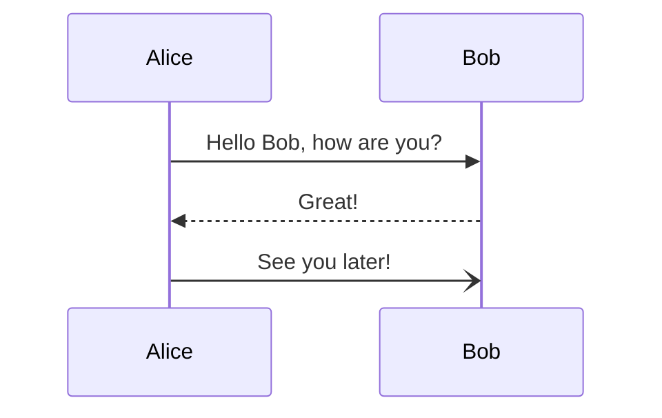
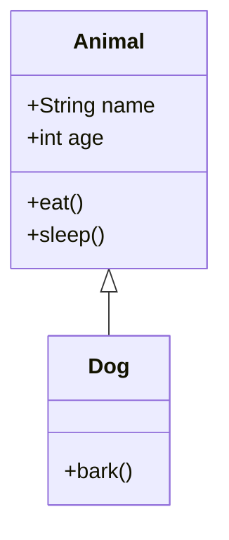

# 🎨 Excalidraw Desktop

[](https://opensource.org/licenses/MIT)
[](https://electronjs.org/)
[](https://reactjs.org/)
[](https://www.typescriptlang.org/)

Um aplicativo desktop Windows que integra o **Excalidraw** com funcionalidades de conversão **Mermaid-to-Excalidraw**, empacotado em Electron para máxima compatibilidade e performance.

## ✨ Funcionalidades Principais

### 🎯 **Excalidraw Completo**
- ✅ **Canvas Infinito**: Desenhe sem limites de espaço
- ✅ **Ferramentas Completas**: Retângulos, círculos, setas, texto, formas livres
- ✅ **Estilo Hand-drawn**: Visual único e profissional
- ✅ **Tema Claro/Escuro**: Adaptação automática ao sistema
- ✅ **Zoom e Pan**: Navegação fluida pelo canvas
- ✅ **Undo/Redo**: Controle total das ações

### 🔄 **Integração Mermaid Avançada**
- ✅ **Conversão em Tempo Real**: Preview antes de inserir
- ✅ **Suporte Completo**: Flowchart, Sequence, Class, State, Gantt
- ✅ **Editor Integrado**: Interface amigável para código Mermaid
- ✅ **Validação Automática**: Detecção de erros de sintaxe
- ✅ **Templates Prontos**: Exemplos para começar rapidamente

### 🖥️ **Recursos Desktop Nativos**
- ✅ **Menu Nativo Windows**: Integração completa com o sistema
- ✅ **Atalhos de Teclado**: Produtividade máxima
- ✅ **Drag & Drop**: Arraste arquivos diretamente
- ✅ **Persistência Local**: Salvar/abrir arquivos .excalidraw
- ✅ **Múltiplas Janelas**: Trabalhe com vários projetos
- ✅ **Notificações**: Feedback visual das ações

### 💾 **Sistema de Arquivos**
- ✅ **Formato .excalidraw**: Compatível com versão web
- ✅ **Auto-save**: Salvamento automático opcional
- ✅ **Exportação**: PNG, SVG, PDF
- ✅ **Importação**: Suporte a múltiplos formatos
- ✅ **Versionamento**: Controle de mudanças não salvas

## 📦 Tipos de Diagrama Mermaid Suportados

| Tipo | Status | Descrição |
|------|--------|-----------|
| **Flowchart** | ✅ | Diagramas de fluxo e processos |
| **Sequence Diagram** | ✅ | Diagramas de sequência e interações |
| **Class Diagram** | ✅ | Diagramas de classes UML |
| **State Diagram** | ✅ | Diagramas de estados |
| **Gantt Chart** | ✅ | Gráficos de Gantt para projetos |
| **Entity Relationship** | 🔄 | Diagramas ER (em desenvolvimento) |
| **Pie Chart** | 🔄 | Gráficos de pizza (em desenvolvimento) |
| **Git Graph** | 🔄 | Gráficos de commits Git (em desenvolvimento) |

## 🚀 Download e Instalação

### 📥 **Versões Disponíveis**

#### **Instalador Windows (.exe)**
- **Arquivo**: `Excalidraw Desktop Setup 1.0.0.exe`
- **Tamanho**: ~150MB
- **Requisitos**: Windows 10/11 (64-bit)
- **Instalação**: Instalação tradicional com desinstalador

#### **Versão Portátil**
- **Arquivo**: `Excalidraw Desktop 1.0.0.exe`
- **Tamanho**: ~200MB
- **Requisitos**: Windows 10/11 (64-bit)
- **Uso**: Executável direto, sem instalação

### 🔧 **Instalação Rápida**

1. **Baixe** a versão desejada da seção [Releases](../../releases)
2. **Execute** o arquivo baixado
3. **Siga** as instruções do instalador (se aplicável)
4. **Inicie** o aplicativo pelo menu Iniciar ou desktop

## 🛠️ Desenvolvimento

### 📋 **Pré-requisitos**

- **Node.js**: 18.x ou superior
- **Yarn**: 1.22.22 (recomendado)
- **Git**: Para controle de versão
- **Windows**: 10/11 para desenvolvimento

### ⚡ **Instalação Rápida**

```bash
# 1. Clonar o repositório
git clone https://github.com/fernandopicardi/excalidraw-desktop.git
cd excalidraw-desktop

# 2. Instalar dependências
yarn install

# 3. Modo desenvolvimento
yarn dev

# 4. Build para produção
yarn build

# 5. Criar instalador
yarn dist
```

### 📜 **Scripts Disponíveis**

| Comando | Descrição | Uso |
|---------|-----------|-----|
| `yarn dev` | Modo desenvolvimento | Desenvolvimento ativo |
| `yarn build` | Build do renderer | Compilar React |
| `yarn start` | Executar Electron | Teste local |
| `yarn dist` | Criar instalador | Distribuição |
| `yarn pack:portable` | Versão portátil | Executável único |
| `yarn test` | Executar testes | Qualidade |
| `yarn lint` | Verificar código | Padrões |

## 🏗️ Arquitetura Técnica

### 📁 **Estrutura do Projeto**

```
excalidraw-desktop/
├── electron/                    # Processo principal Electron
│   ├── main.js                 # Janela principal e menu nativo
│   └── preload.js              # API segura para renderer
├── packages/
│   └── desktop-renderer/       # Aplicação React + Excalidraw
│       ├── src/
│       │   ├── components/     # Componentes React
│       │   │   ├── MermaidConverter.tsx
│       │   │   └── DesktopMenu.tsx
│       │   ├── hooks/          # Hooks customizados
│       │   │   └── useElectronAPI.ts
│       │   ├── utils/          # Utilitários
│       │   │   └── fileUtils.ts
│       │   └── styles/         # Estilos CSS
│       └── package.json
├── build/                      # Build de produção
├── dist/                       # Aplicativo empacotado
│   ├── Excalidraw Desktop Setup 1.0.0.exe
│   └── Excalidraw Desktop 1.0.0.exe
└── assets/                     # Recursos (ícones, etc.)
```

### 🔧 **Tecnologias Utilizadas**

| Tecnologia | Versão | Propósito |
|------------|--------|-----------|
| **Electron** | 28.3.3 | Framework desktop |
| **React** | 18.2.0 | Interface de usuário |
| **TypeScript** | 5.0.0 | Linguagem principal |
| **Vite** | 5.4.21 | Build tool e dev server |
| **Excalidraw** | 0.17.1 | Editor de desenho |
| **Mermaid** | 10.9.4 | Conversão de diagramas |

## 🎯 Guia de Uso

### 🆕 **Criar Novo Diagrama**

1. **Inicie** o aplicativo
2. **Use** `Ctrl+N` ou menu File > New
3. **Desenhe** livremente com as ferramentas do Excalidraw
4. **Salve** com `Ctrl+S` quando necessário

### 🔄 **Importar Diagrama Mermaid**

1. **Abra** o modal: `Ctrl+M` ou menu File > Import Mermaid
2. **Cole** o código Mermaid no editor
3. **Clique** em "Convert" para preview
4. **Revise** o resultado no preview
5. **Clique** em "Insert into Canvas" para adicionar

### 💾 **Gerenciar Arquivos**

| Ação | Atalho | Menu |
|------|--------|------|
| **Novo** | `Ctrl+N` | File > New |
| **Abrir** | `Ctrl+O` | File > Open |
| **Salvar** | `Ctrl+S` | File > Save |
| **Salvar Como** | `Ctrl+Shift+S` | File > Save As |
| **Importar Mermaid** | `Ctrl+M` | File > Import Mermaid |

### ⌨️ **Atalhos de Teclado**

| Atalho | Ação | Descrição |
|--------|------|-----------|
| `Ctrl+N` | Novo | Criar novo diagrama |
| `Ctrl+O` | Abrir | Abrir arquivo existente |
| `Ctrl+S` | Salvar | Salvar arquivo atual |
| `Ctrl+Shift+S` | Salvar Como | Salvar com novo nome |
| `Ctrl+M` | Mermaid | Importar diagrama Mermaid |
| `Ctrl+Z` | Desfazer | Desfazer última ação |
| `Ctrl+Y` | Refazer | Refazer ação desfeita |
| `Ctrl+Shift+T` | Tema | Alternar tema claro/escuro |

## 📋 Exemplos de Código Mermaid

### 🔄 **Flowchart Simples**


### 📊 **Sequence Diagram**


### 🏗️ **Class Diagram**


## ⚙️ Configurações e Personalização

### 🎨 **Temas**
- **Automático**: Baseado no tema do sistema Windows
- **Manual**: Toggle com `Ctrl+Shift+T`
- **Persistente**: Lembra a preferência entre sessões

### 🔧 **Configurações Avançadas**
- **Tamanho da Fonte**: Ajustável no modal Mermaid
- **Estilo das Setas**: Linear ou Basis
- **Cores**: Personalizáveis por diagrama
- **Limites**: Máximo de elementos e caracteres

### 📁 **Gerenciamento de Arquivos**
- **Formato Nativo**: `.excalidraw` (compatível com web)
- **Backup Automático**: Opcional
- **Histórico**: Undo/Redo ilimitado
- **Exportação**: PNG, SVG, PDF

## 🚀 Distribuição e Instalação

### 📦 **Versões Disponíveis**

#### **Instalador Windows (.exe)**
- ✅ **Arquivo**: `Excalidraw Desktop Setup 1.0.0.exe`
- ✅ **Tamanho**: ~150MB
- ✅ **Requisitos**: Windows 10/11 (64-bit)
- ✅ **Recursos**: Instalação completa, desinstalador, atalhos

#### **Versão Portátil**
- ✅ **Arquivo**: `Excalidraw Desktop 1.0.0.exe`
- ✅ **Tamanho**: ~200MB
- ✅ **Requisitos**: Windows 10/11 (64-bit)
- ✅ **Recursos**: Executável único, sem instalação

### 🔄 **Atualizações**
- **Automáticas**: Notificações de novas versões
- **Manuais**: Download da seção Releases
- **Compatibilidade**: Mantém arquivos existentes

## 🤝 Contribuição

### 🚀 **Como Contribuir**

1. **Fork** o projeto no GitHub
2. **Clone** seu fork localmente
3. **Crie** uma branch para sua feature:
   ```bash
   git checkout -b feature/nova-funcionalidade
   ```
4. **Desenvolva** sua funcionalidade
5. **Teste** com `yarn dev` e `yarn build`
6. **Commit** suas mudanças:
   ```bash
   git commit -m 'feat: adiciona nova funcionalidade'
   ```
7. **Push** para sua branch:
   ```bash
   git push origin feature/nova-funcionalidade
   ```
8. **Abra** um Pull Request

### 🐛 **Reportar Bugs**

- Use o [GitHub Issues](https://github.com/fernandopicardi/excalidraw-desktop/issues)
- Inclua: versão do Windows, passos para reproduzir, logs de erro
- Use o template de bug report

### 💡 **Sugerir Funcionalidades**

- Use o [GitHub Issues](https://github.com/fernandopicardi/excalidraw-desktop/issues)
- Marque como "enhancement"
- Descreva o caso de uso e benefícios

## 📄 Licença

Este projeto está sob a licença **MIT**. Veja o arquivo [LICENSE](LICENSE) para detalhes.

```
MIT License

Copyright (c) 2025 fernandopicardi

Permission is hereby granted, free of charge, to any person obtaining a copy
of this software and associated documentation files (the "Software"), to deal
in the Software without restriction, including without limitation the rights
to use, copy, modify, merge, publish, distribute, sublicense, and/or sell
copies of the Software, and to permit persons to whom the Software is
furnished to do so, subject to the following conditions:

The above copyright notice and this permission notice shall be included in all
copies or substantial portions of the Software.

THE SOFTWARE IS PROVIDED "AS IS", WITHOUT WARRANTY OF ANY KIND, EXPRESS OR
IMPLIED, INCLUDING BUT NOT LIMITED TO THE WARRANTIES OF MERCHANTABILITY,
FITNESS FOR A PARTICULAR PURPOSE AND NONINFRINGEMENT. IN NO EVENT SHALL THE
AUTHORS OR COPYRIGHT HOLDERS BE LIABLE FOR ANY CLAIM, DAMAGES OR OTHER
LIABILITY, WHETHER IN AN ACTION OF CONTRACT, TORT OR OTHERWISE, ARISING FROM,
OUT OF OR IN CONNECTION WITH THE SOFTWARE OR THE USE OR OTHER DEALINGS IN THE
SOFTWARE.
```

## 🙏 Agradecimentos

### 🏆 **Projetos Base**
- **[Excalidraw](https://excalidraw.com)** - Editor de desenho incrível
- **[Mermaid](https://mermaid-js.github.io)** - Biblioteca de diagramas
- **[Electron](https://electronjs.org)** - Framework desktop multiplataforma
- **[React](https://reactjs.org)** - Biblioteca de interface de usuário

### 👥 **Contribuidores**
- **fernandopicardi** - Desenvolvedor principal
- **Comunidade Excalidraw** - Inspiração e base técnica
- **Comunidade Mermaid** - Funcionalidades de diagramas

### 🛠️ **Ferramentas**
- **Vite** - Build tool rápido e moderno
- **TypeScript** - Tipagem estática
- **Yarn** - Gerenciador de pacotes
- **Electron Builder** - Empacotamento e distribuição

## 📞 Suporte e Contato

### 🐛 **Reportar Problemas**
- **GitHub Issues**: [Reportar Bug](https://github.com/fernandopicardi/excalidraw-desktop/issues/new?template=bug_report.md)
- **Email**: fernandopicardi@gmail.com
- **Discord**: [Servidor da Comunidade](https://discord.gg/excalidraw)

### 💬 **Discussões**
- **GitHub Discussions**: [Discutir Ideias](https://github.com/fernandopicardi/excalidraw-desktop/discussions)
- **Feature Requests**: [Sugerir Funcionalidades](https://github.com/fernandopicardi/excalidraw-desktop/issues/new?template=feature_request.md)

### 📚 **Documentação**
- **Wiki**: [Documentação Completa](https://github.com/fernandopicardi/excalidraw-desktop/wiki)
- **FAQ**: [Perguntas Frequentes](https://github.com/fernandopicardi/excalidraw-desktop/wiki/FAQ)
- **Tutoriais**: [Guias Passo a Passo](https://github.com/fernandopicardi/excalidraw-desktop/wiki/Tutorials)

---

<div align="center">

**🎨 Desenvolvido com ❤️ por [fernandopicardi](https://github.com/fernandopicardi)**

[](https://github.com/fernandopicardi)
[](mailto:fernandopicardi@gmail.com)

**⭐ Se este projeto te ajudou, considere dar uma estrela! ⭐**

</div>
